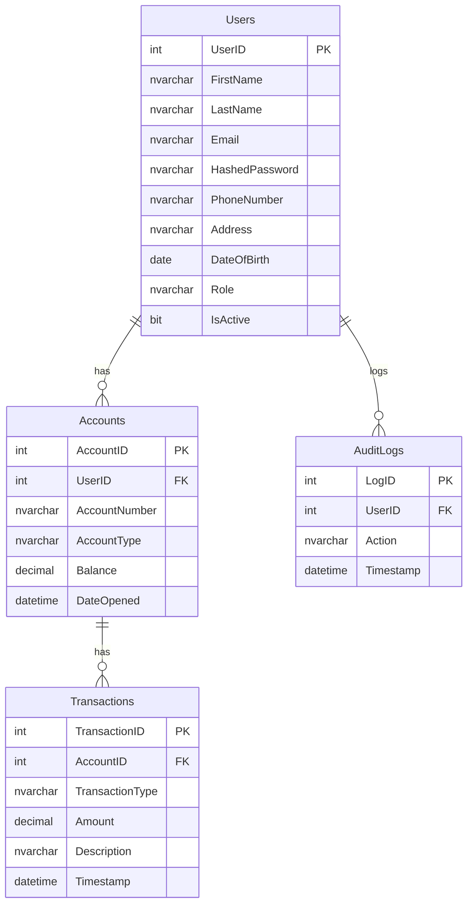

# 🏦 Bank Management System

<div align="center">


**A comprehensive desktop banking application demonstrating advanced Object-Oriented Programming principles**

[Features](#-features) • [Architecture](#-architecture) • [Installation](#-installation) • [Usage](#-usage) • [Demo](#-demo) • [Contributing](#-contributing)

</div>

---

## 📋 Overview

The **Bank Management System** is a feature-rich desktop application built with C# and Windows Forms that simulates real-world banking operations. This project showcases professional software development practices, including secure authentication, role-based access control, and comprehensive transaction management.

### 🎯 Project Objectives

- **Real-Life Banking Scenarios**: Authentic banking operations with industry-standard validation
- **OOP Principles**: Practical implementation of encapsulation, inheritance, polymorphism, and abstraction
- **Security Implementation**: BCrypt password hashing, session management, and secure data handling
- **Multi-Layer Architecture**: Clean separation of concerns with presentation, business, and data layers
- **Comprehensive Testing**: Real-world test scenarios and validation

## ✨ Features

### 🔐 Authentication & Security
- **Secure User Authentication** with BCrypt password hashing
- **Role-Based Access Control** (Admin, Employee, Customer)
- **Session Management** with automatic timeout
- **Password Complexity** requirements and validation

### 💼 Account Management
- **Dynamic Account Creation** with unique account number generation
- **Multiple Account Types** support (Savings, Checking, etc.)
- **Real-time Balance Tracking** and validation
- **Account Status Management** (Active, Suspended, Closed)

### 💰 Transaction Processing
- **Secure Deposits & Withdrawals** with business rule validation
- **Inter-Account Transfers** with verification protocols
- **Transaction History** with detailed audit trails
- **Real-time Balance Updates** and notifications

### 👥 User Management
- **Customer Registration** with comprehensive validation
- **Employee Management** tools for administrative tasks
- **User Profile Management** with update capabilities
- **Activity Monitoring** and audit logging

### 📊 Administrative Tools
- **System Dashboard** with key performance indicators
- **User & Account Analytics** for business insights
- **Transaction Monitoring** and reporting
- **Security Audit Logs** and compliance tracking

## 🏗️ Architecture

The application follows a **clean, modular architecture** with clear separation of concerns:

```
┌─────────────────────────────────────┐
│         Presentation Layer          │
│    (Windows Forms & User Interface) │
├─────────────────────────────────────┤
│         Business Logic Layer        │
│  (Validation, Security, Services)   │
├─────────────────────────────────────┤
│         Data Access Layer           │
│    (Database Operations & Models)   │
└─────────────────────────────────────┘
```

### 🗂️ Project Structure
- **`Forms/`** - User interface components and form handlers
- **`Classes/`** - Core business logic and data models
- **`DataBase Schema/`** - SQL scripts and database configuration
- **`Resources/`** - Assets, icons, and multimedia files
- **`Documentation/`** - Comprehensive project documentation

### 🔧 Core Technologies
- **Framework**: .NET Framework 4.7.2+
- **UI Technology**: Windows Forms
- **Database**: SQL Server / SQL Server Express
- **Security**: BCrypt.Net for password hashing
- **Architecture Pattern**: Layered Architecture with MVC principles

## 🚀 Installation

### Prerequisites
- **Visual Studio 2019+** or **Visual Studio Code** with C# extension
- **.NET Framework 4.7.2** or higher
- **SQL Server 2017+** or **SQL Server Express**
- **Git** for version control

### Quick Start

1. **Clone the Repository**
   ```bash
   git clone https://github.com/yourusername/bank-management-system.git
   cd bank-management-system
   ```

2. **Database Setup**
   ```sql
   -- Execute the database scripts in SQL Server Management Studio
   -- 1. Run BankManagementSystem_DDL.sql to create tables
   -- 2. Run Sql.sql for initial data (optional)
   ```

3. **Configure Connection String**
   ```xml
   <!-- Update App.config with your SQL Server connection -->
   <connectionStrings>
     <add name="BankDB" 
          connectionString="Server=localhost;Database=BankManagementSystem;Integrated Security=true;" />
   </connectionStrings>
   ```

4. **Build and Run**
   ```bash
   # Open in Visual Studio and press F5, or use CLI:
   dotnet build
   dotnet run
   ```

## 📱 Usage Guide

#### 🔑 Login Credentials (Demo)
- **Admin**: `admin@bank.com` / `admin123`
- **Employee**: `employee@bank.com` / `emp123`
- **Customer**: `customer@bank.com` / `cust123`

#### 🎮 Key Workflows

1. **Customer Registration**
   - Navigate to Registration Form
   - Fill required fields with validation
   - System generates unique account number
   - Login with new credentials

2. **Account Operations**
   - Login as Customer/Employee
   - Access account dashboard
   - Perform deposits, withdrawals, transfers
   - View transaction history

3. **Administrative Tasks**
   - Login as Admin
   - Manage users and accounts
   - Monitor system activities
   - Generate reports

## 📸 Screenshots

<div align="center">

### 🏠 Dashboard Overview


### 💳 Transaction Interface


### 👤 User Management


</div>

## 🛠️ Technical Implementation

### 🔒 Security Features
- **Password Hashing**: BCrypt with salt for secure storage
- **Session Management**: Automatic timeout and secure logout
- **Input Validation**: SQL injection prevention and data sanitization
- **Role-Based Access**: Granular permissions by user type

### 🎯 Design Patterns
- **Repository Pattern**: Data access abstraction
- **Factory Pattern**: Object creation and initialization
- **Observer Pattern**: Event-driven notifications
- **Singleton Pattern**: Database connection management

### 📊 Data Validation Layers
1. **Client-Side**: Form validation and user feedback
2. **Business Logic**: Business rule enforcement
3. **Database**: Constraint validation and referential integrity

## 📚 Documentation

| Document | Description |
|----------|-------------|
| [`DEMO_README.MD`](DEMO_README.MD) | Comprehensive demo scenarios and use cases |
| [`FUNCTIONAL_REQUIREMENTS.MD`](FUNCTIONAL_REQUIREMENTS.MD) | Detailed functional specifications |
| [`PROJECT_SUMMARY.MD`](PROJECT_SUMMARY.MD) | Executive summary and achievements |
| [`TEST_SCENARIOS.MD`](TEST_SCENARIOS.MD) | Testing scenarios and validation cases |
| [`QUICK_START_REFERENCE.MD`](QUICK_START_REFERENCE.MD) | Quick reference for developers |
| [`LOAD_SOLUTION_GUIDE.MD`](LOAD_SOLUTION_GUIDE.MD) | Setup and configuration guide |

## 🗄️ Database Schema

The following tables define the full database schema for the Bank Management System:

```sql
CREATE TABLE Users (
  UserID INT PRIMARY KEY,
  FirstName NVARCHAR(100),
  LastName NVARCHAR(100),
  Email NVARCHAR(255) UNIQUE,
  HashedPassword NVARCHAR(255),
  PhoneNumber NVARCHAR(20),
  Address NVARCHAR(255),
  DateOfBirth DATE,
  Role NVARCHAR(50),
  IsActive BIT
);

CREATE TABLE Accounts (
  AccountID INT PRIMARY KEY,
  UserID INT,
  AccountNumber NVARCHAR(50),
  AccountType NVARCHAR(50),
  Balance DECIMAL(18,2),
  DateOpened DATETIME,
  FOREIGN KEY (UserID) REFERENCES Users(UserID)
);

CREATE TABLE Transactions (
  TransactionID INT PRIMARY KEY,
  AccountID INT,
  TransactionType NVARCHAR(50),
  Amount DECIMAL(18,2),
  Description NVARCHAR(255),
  Timestamp DATETIME,
  FOREIGN KEY (AccountID) REFERENCES Accounts(AccountID)
);

CREATE TABLE AuditLogs (
  LogID INT PRIMARY KEY,
  UserID INT,
  Action NVARCHAR(255),
  Timestamp DATETIME,
  FOREIGN KEY (UserID) REFERENCES Users(UserID)
);
```

## Example SQL Operations

Below are example SQL queries for common operations on each table:

### Users

```sql
-- Create
INSERT INTO Users (FirstName, LastName, Email, HashedPassword, PhoneNumber, Address, DateOfBirth, Role, IsActive)
VALUES ('John', 'Doe', 'john.doe@email.com', 'hashed_pw', '1234567890', '123 Main St', '1990-01-01', 'Customer', 1);

-- Read
SELECT * FROM Users WHERE Email = 'john.doe@email.com';

-- Update
UPDATE Users SET PhoneNumber = '0987654321' WHERE UserID = 1;

-- Delete
DELETE FROM Users WHERE UserID = 1;
```

### Accounts

```sql
-- Create
INSERT INTO Accounts (UserID, AccountNumber, AccountType, Balance, DateOpened)
VALUES (1, 'ACC123456', 'Savings', 1000.00, GETDATE());

-- Read
SELECT * FROM Accounts WHERE UserID = 1;

-- Update
UPDATE Accounts SET Balance = Balance + 500 WHERE AccountID = 1;

-- Delete
DELETE FROM Accounts WHERE AccountID = 1;
```

### Transactions

```sql
-- Create
INSERT INTO Transactions (AccountID, TransactionType, Amount, Description, Timestamp)
VALUES (1, 'Deposit', 500.00, 'Initial deposit', GETDATE());

-- Read
SELECT * FROM Transactions WHERE AccountID = 1;

-- Update
UPDATE Transactions SET Description = 'Updated description' WHERE TransactionID = 1;

-- Delete
DELETE FROM Transactions WHERE TransactionID = 1;
```

### AuditLogs

```sql
-- Create
INSERT INTO AuditLogs (UserID, Action, Timestamp)
VALUES (1, 'User logged in', GETDATE());

-- Read
SELECT * FROM AuditLogs WHERE UserID = 1;

-- Update
UPDATE AuditLogs SET Action = 'User updated profile' WHERE LogID = 1;

-- Delete
DELETE FROM AuditLogs WHERE LogID = 1;
```

## Entity-Relationship (ER) Diagram

Below is a text-based ER diagram representing the relationships between tables in the Bank Management System:



## 🧪 Testing

### Test Coverage
- **Unit Tests**: Core business logic validation
- **Integration Tests**: Database operations and API endpoints
- **UI Tests**: Form validation and user workflows
- **Security Tests**: Authentication and authorization

### Test Scenarios
Comprehensive test scenarios are documented in [`TEST_SCENARIOS.MD`](TEST_SCENARIOS.MD) including:
- User registration and authentication flows
- Account creation and management
- Transaction processing and validation
- Error handling and edge cases

## 🚀 Demo & Live Preview

### 🎥 Video Demonstration
> **Coming Soon**: Interactive video walkthrough of key features

### 🌐 Live Demo
> **Note**: This is a desktop application. Contact the repository owner for a demonstration.

## 🤝 Contributing

We welcome contributions to improve the Bank Management System! Here's how you can help:

### 📋 How to Contribute

1. **Fork the Repository**
   ```bash
   git fork https://github.com/yourusername/bank-management-system.git
   ```

2. **Create a Feature Branch**
   ```bash
   git checkout -b feature/amazing-feature
   ```

3. **Make Your Changes**
   - Follow the existing code style and conventions
   - Add appropriate comments and documentation
   - Include unit tests for new features

4. **Commit Your Changes**
   ```bash
   git commit -m "Add amazing feature"
   ```

5. **Push to Your Branch**
   ```bash
   git push origin feature/amazing-feature
   ```

6. **Open a Pull Request**
   - Provide a clear description of your changes
   - Reference any related issues
   - Include screenshots for UI changes

### 🐛 Bug Reports
If you find a bug, please create an issue with:
- Clear steps to reproduce
- Expected vs actual behavior
- System information (OS, .NET version, etc.)
- Screenshots if applicable

### 💡 Feature Requests
For new features, please:
- Check existing issues first
- Provide detailed use cases
- Explain the business value
- Consider implementation complexity

## 📜 License

This project is licensed under the **MIT License** - see the [LICENSE](LICENSE) file for details.

```
MIT License

Copyright (c) 2025 Bank Management System

Permission is hereby granted, free of charge, to any person obtaining a copy
of this software and associated documentation files (the "Software"), to deal
in the Software without restriction, including without limitation the rights
to use, copy, modify, merge, publish, distribute, sublicense, and/or sell
copies of the Software, and to permit persons to whom the Software is
furnished to do so, subject to the following conditions:

The above copyright notice and this permission notice shall be included in all
copies or substantial portions of the Software.

THE SOFTWARE IS PROVIDED "AS IS", WITHOUT WARRANTY OF ANY KIND, EXPRESS OR
IMPLIED, INCLUDING BUT NOT LIMITED TO THE WARRANTIES OF MERCHANTABILITY,
FITNESS FOR A PARTICULAR PURPOSE AND NONINFRINGEMENT. IN NO EVENT SHALL THE
AUTHORS OR COPYRIGHT HOLDERS BE LIABLE FOR ANY CLAIM, DAMAGES OR OTHER
LIABILITY, WHETHER IN AN ACTION OF CONTRACT, TORT OR OTHERWISE, ARISING FROM,
OUT OF OR IN CONNECTION WITH THE SOFTWARE OR THE USE OR OTHER DEALINGS IN THE
SOFTWARE.
```

## 🙏 Acknowledgments

- **Inspiration**: Real-world banking systems and enterprise applications
- **Security**: BCrypt.Net library for secure password hashing
- **UI Framework**: Windows Forms for rapid desktop development
- **Database**: SQL Server for reliable data persistence
- **Community**: Open source contributors and the C# development community

## 📞 Support & Contact

### 📧 Get in Touch
- **Email**: [your.email@example.com](mailto:your.email@example.com)
- **LinkedIn**: [Your LinkedIn Profile](https://linkedin.com/in/yourprofile)
- **GitHub**: [@yourusername](https://github.com/yourusername)

### 🆘 Need Help?
- 📖 **Documentation**: Check our comprehensive documentation files
- 🐛 **Issues**: Report bugs or request features via GitHub Issues
- 💬 **Discussions**: Join conversations in GitHub Discussions
- 🔍 **FAQ**: Common questions and solutions in the Wiki

---

<div align="center">

**⭐ Star this repository if you found it helpful!**

[](https://github.com/yourusername/bank-management-system/stargazers)
[](https://github.com/yourusername/bank-management-system/network)
[](https://github.com/yourusername/bank-management-system/issues)

**Made with ❤️ for the development community**

</div>
